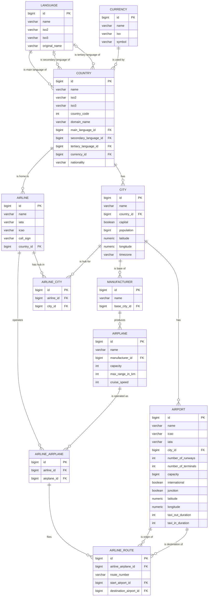

# Entity-Relationship Diagram

Generated from the schema in
[`V1__create_tables.sql`](../modules/persistence/src/main/resources/db/migration/V1__create_tables.sql)
plus later migrations (airport coordinates/taxi times, airplane cruise speed). Update this
diagram whenever a migration adds/renames/removes a table or column.

Every table also has `created_at` and `last_updated_at` timestamp columns (omitted below for
brevity — see [`V2__create_update_triggers.sql`](../modules/persistence/src/main/resources/db/migration/V2__create_update_triggers.sql)
for the triggers that maintain them).

